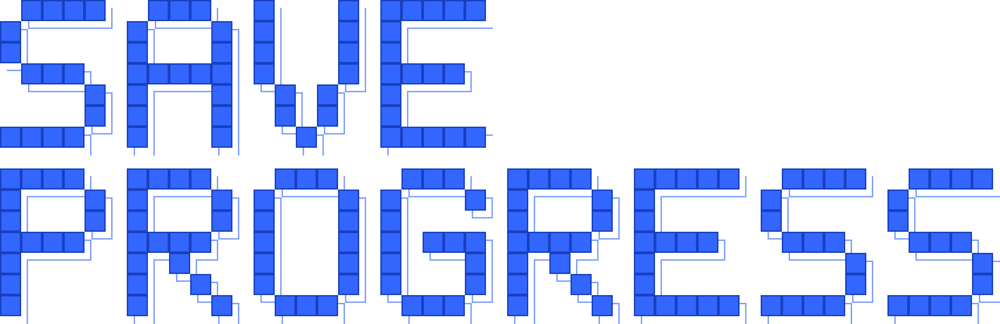

**A Claude skill that stops your AI forgetting every correction you give it.**

You correct Claude. It thanks you. Tomorrow it does the same thing again.

The moment your AI most needs to learn from you, the moment you tell it it got something wrong, is
the one moment nothing captures. So you explain the same preference on Monday, fix the same mistake
on Thursday, and start from zero next week.

This skill runs at the end of a session. You type two words. It reads back over the conversation,
works out what is worth keeping, and files each thing where it belongs, without overwriting anything
already there.

```
save progress
```

That is the entire interface.

## What makes it different

Most memory systems sort what they learn by **topic**. This one sorts by **how long it should last**.

That single change is what stops a memory file turning into landfill.

| Bucket | What it is | How long it lasts |
|---|---|---|
| A durable rule | A preference that should apply to every future job | Forever, until you change it |
| A one-off override | A choice true for this one piece only | This piece only. Never becomes a rule |
| Project state | What shipped, what is open, what you are waiting on | Until the project ships |
| A lesson | A mistake that should not repeat | Permanent, as a warning |

### The safeguard

Before anything is filed as a permanent rule, one question:

> **Would I want this applied to every future job?**

If no, it is an override. It goes in project notes and never becomes a rule.

Promoting a one-time choice into a global rule is the failure that quietly poisons a memory system.
It is invisible for weeks, then suddenly every output carries a preference you expressed once, about
one thing, months ago.

### It will not clobber your work

Every write follows the same protocol. Read the file first. Find any existing entry on the same
topic. Update that entry in place rather than adding a duplicate. Never delete an existing rule. If
something new contradicts something old, surface the conflict instead of silently overwriting.

### Retire, do not stack

A session that adds five rules and retires none has made your memory worse, not better. Rule count
is not the goal.

When a new rule supersedes an old one, the old one is marked retired and kept, so you can still read
it back and see how your thinking changed.

### It shows its work

Every run ends in a receipt, so you can see what moved without opening a single file.

```
SAVE PROGRESS — receipt

  Your rules       1 updated   "ask one question before assuming" replaced the older three-question rule
  Project notes    2 added     cream footer (this piece only), client naming for this deliverable
  Lessons          1 added     do not promise a date without checking

  Nothing left open.
```

## Install

### Claude Code

```bash
git clone https://github.com/charlie947/save-progress.git ~/.claude/skills/save-progress
```

Then start a new session and type `save progress` at the end of your next piece of work.

### Claude Desktop

```bash
git clone https://github.com/charlie947/save-progress.git
cd save-progress && zip -r save-progress.skill .
```

Upload `save-progress.skill` through **Customise skills** in the Claude app.

### Claude Chat

The skill works in Chat too. The classifier and the safeguard are the portable part. Only the
destinations change, because Chat cannot write files to your disk:

| Bucket | Claude Code | Claude Chat |
|---|---|---|
| Durable rule | Your memory files | Commits to Memory, plus a block to paste into Project instructions |
| One-off override | Project notes | Deliberately kept out of Memory. Appears in the receipt only |
| Project state | Project file | A paste block for the Project |
| Lesson | Lessons file | Commits to Memory, phrased as a warning |

The safeguard matters more in Chat, not less. Memory there is one shared pool with no folder
structure, so a one-off promoted by mistake follows you into every future conversation with no
obvious way to trace where it came from.

## Usage

Use it at the **end** of a session, once there is something worth keeping.

Say any of these:

- `save progress`
- `bank what we learned`
- `capture the learnings`
- `lock in our corrections`

The first few runs it will show you a routing table before writing, so you can see how it is
bucketing things. Once you trust it, tell it to skip the table and write directly.

One exception stays permanent: if something new contradicts an existing rule, it always asks first.

## What it does not do

- It does not touch your code or run git commits.
- It does not run automatically on every turn. You invoke it, so a quiet session writes nothing.
- It does not re-summarise your conversation. Only durable learnings and project state.
- It does not invent rules you never expressed.

## Licence

MIT. Use it, fork it, change it.

---

Built by [Charlie Hills](https://charliehills.substack.com).

For weekly breakdowns of how to actually get more out of Claude, subscribe to the
[MarTech AI newsletter](https://charliehills.substack.com).

Found a way to improve it?
[Open a PR](https://github.com/charlie947/save-progress/pulls) or
[an issue](https://github.com/charlie947/save-progress/issues).
